# VCoder 技术架构图

**文档版本**: V1.0  
**创建日期**: 2026-01-14  
**基于**: zcode 实现分析 + VCoder V0.5 开发方案

---

## 1. 整体系统架构

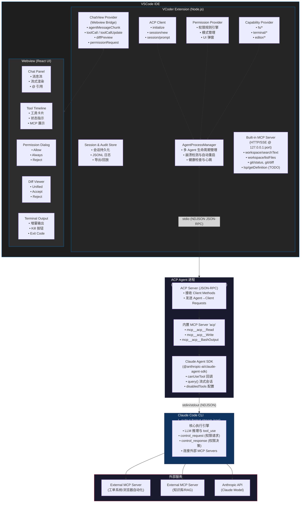

---

## 2. 协议与通信架构

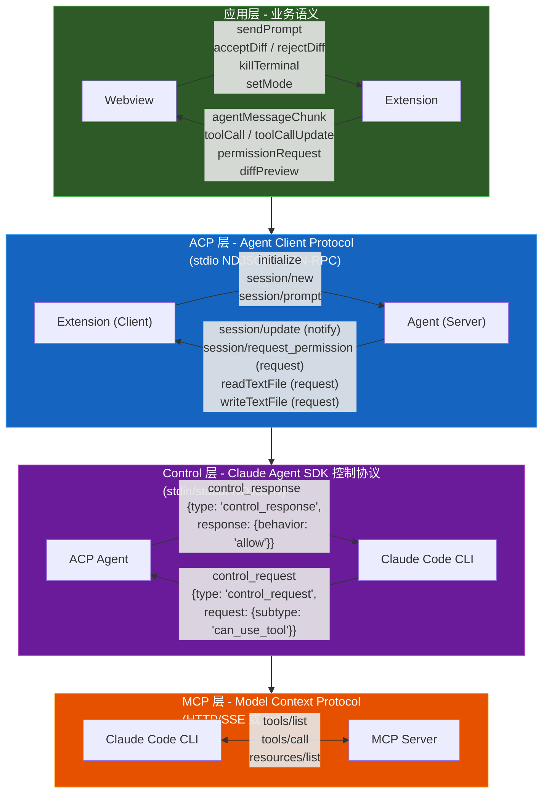

---

## 3. 权限交互时序图

```mermaid
sequenceDiagram
    autonumber
    participant W as Webview (UI)
    participant E as Extension (Client)
    participant A as ACP Agent
    participant S as Claude SDK
    participant C as Claude CLI
    
    W->>E: sendPrompt
    E->>A: session/prompt
    A->>S: query()
    S->>C: 启动 CLI
    
    Note over C: LLM 推理
    Note over C: 决定调用工具 (tool_use)
    
    C->>S: control_request<br/>(can_use_tool)
    S->>A: canUseTool callback
    A->>E: session/request_permission
    E->>W: permissionRequest
    
    Note over W: 用户查看权限请求
    
    rect rgb(40, 40, 60)
        Note over W: 🔒 权限请求对话框<br/>工具: Write<br/>文件: src/app.ts<br/><br/>[Allow] [Always Allow] [Reject]
    end
    
    W->>E: userDecision (allow)
    E->>A: outcome: allow
    A->>S: behavior: allow
    S->>C: control_response
    
    Note over C: 执行工具
    
    C->>S: tool_result
    S->>A: 工具执行结果
    A->>E: session/update (tool_call)
    E->>W: toolCallUpdate
```

---

## 4. 能力协商与工具代理机制

### 4.1 能力协商流程

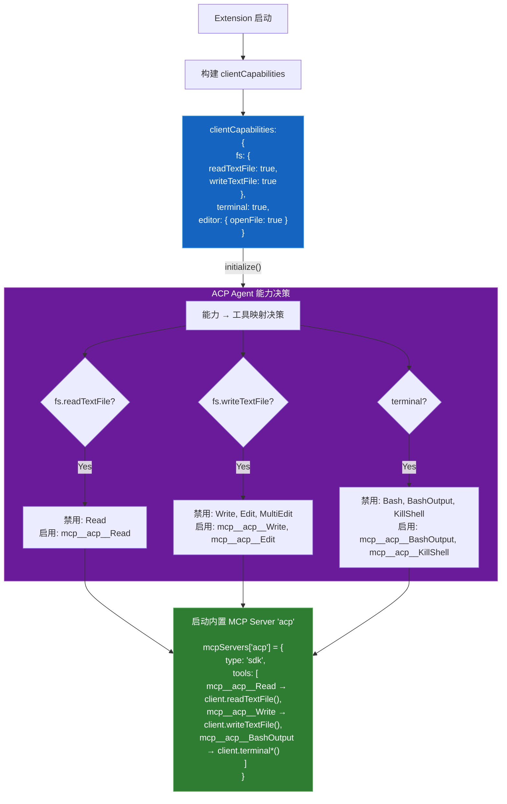

### 4.2 工具代理调用链路

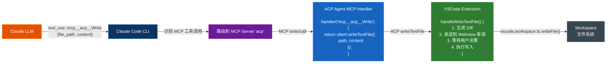

---

## 5. 数据流与状态管理

### 5.1 会话状态模型

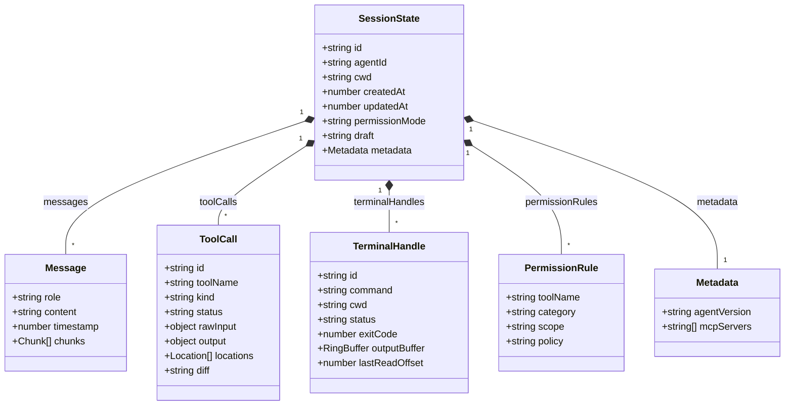

### 5.2 审计日志结构 (JSONL)

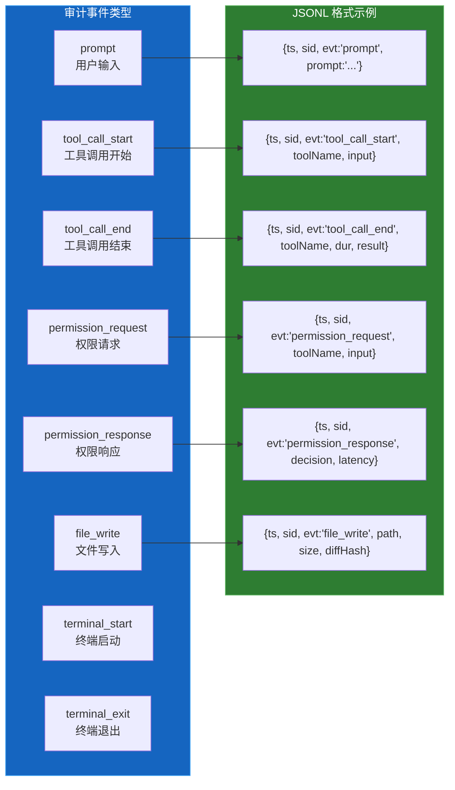

---

## 6. 模块依赖关系

### 6.1 Extension 模块依赖图

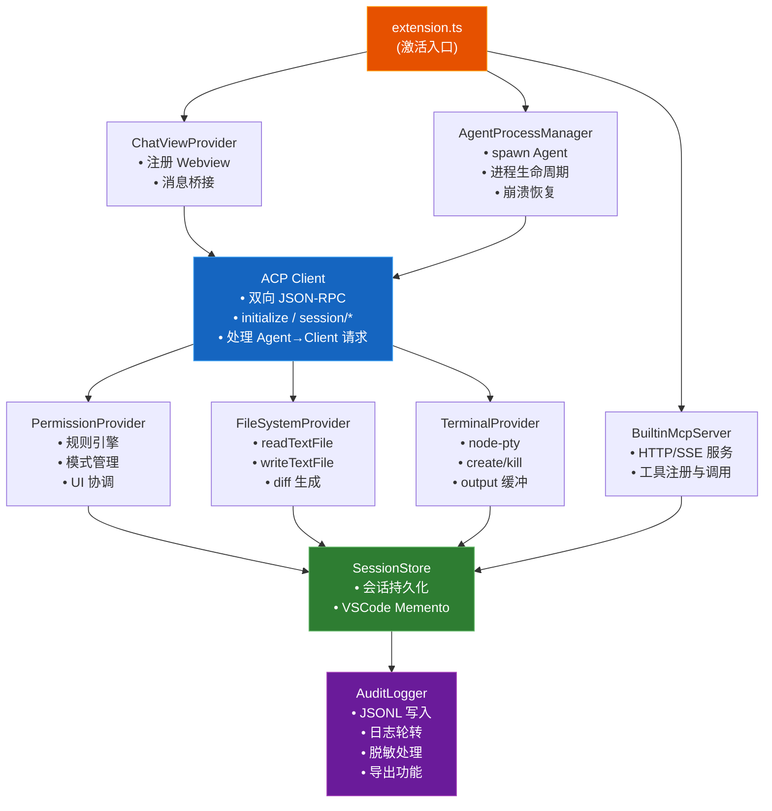

### 6.2 Webview 组件依赖图

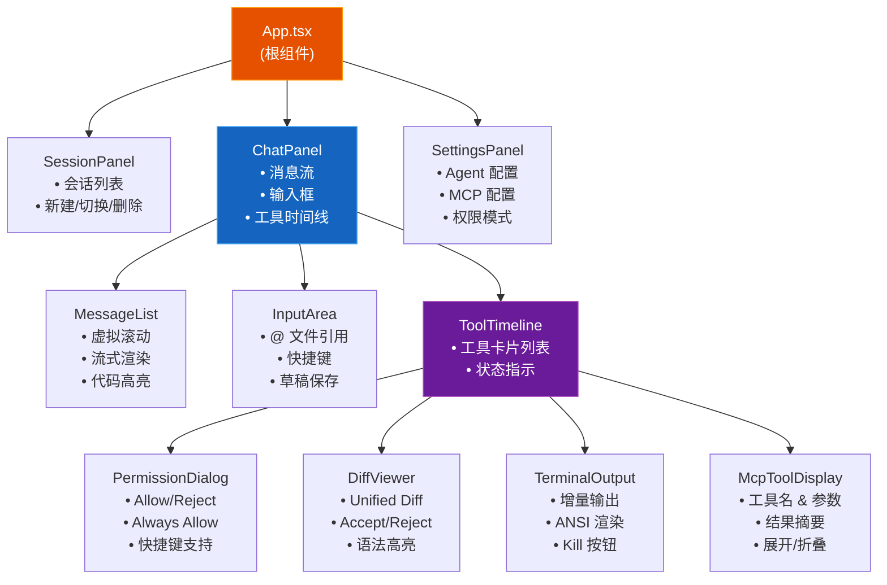

---

## 7. 安全边界与信任模型

### 7.1 安全边界划分

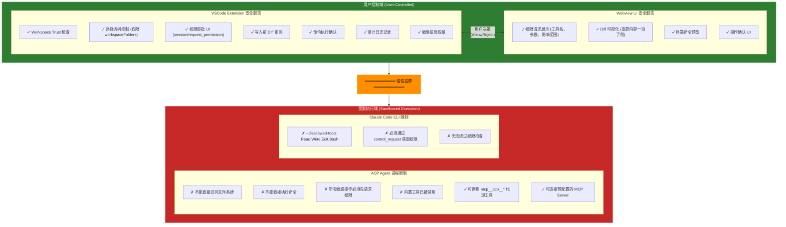

### 7.2 权限模式对照表

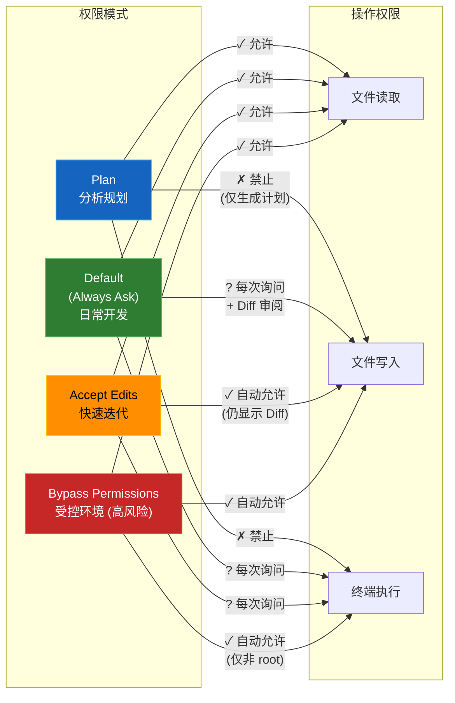

---

## 8. 部署架构

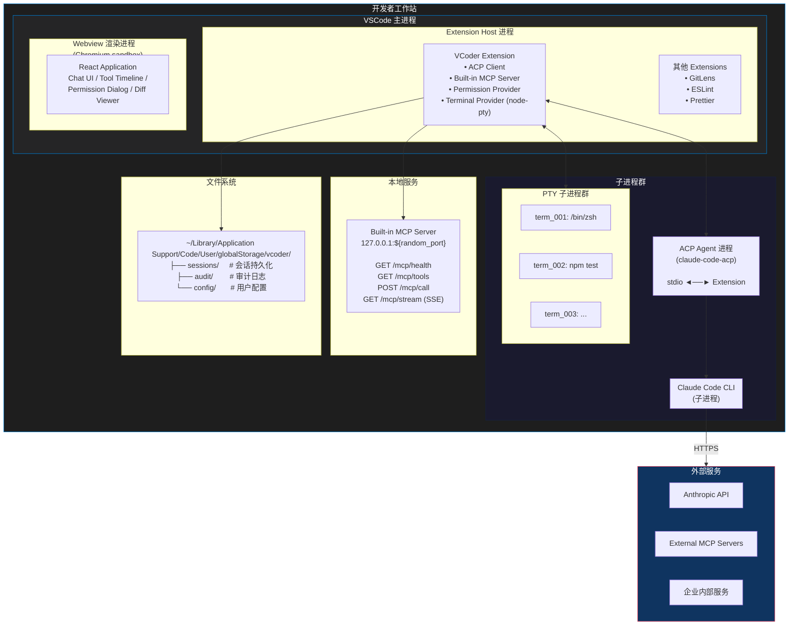

---

## 9. 完整数据流概览

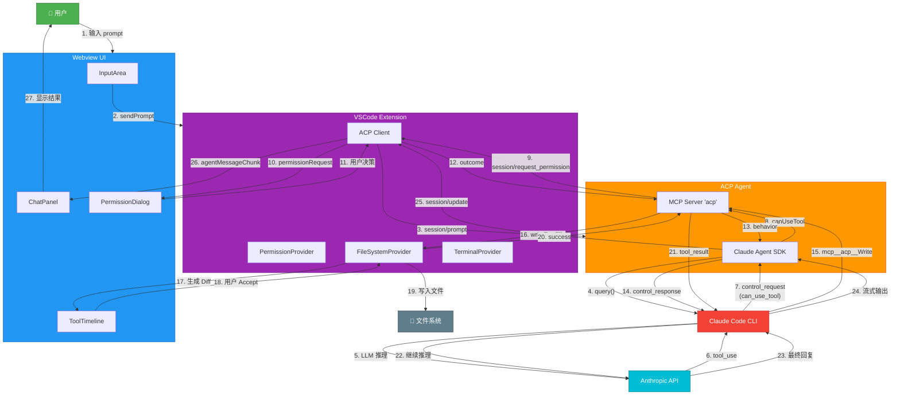

---

## 总结

本架构基于对 zcode (`@zed-industries/claude-code-acp`) 的深入分析，核心设计原则：

| 原则 | 说明 |
|------|------|
| **结构化权限协议** | 不依赖 TTY 的 `y/n` 输入，而是通过 `session/request_permission` 实现无头环境下的可靠交互 |
| **能力协商与工具代理** | 通过 `clientCapabilities` 声明宿主能力，禁用内置工具并改用 `mcp__acp__*` 代理，实现更强的可控性 |
| **分层安全边界** | Extension 掌握所有敏感操作的最终决策权，Agent 只能通过定义好的 Client Methods 请求执行 |
| **可观测性** | 完整的审计日志记录所有工具调用、权限决策、文件变更 |

---

**文档结束**
