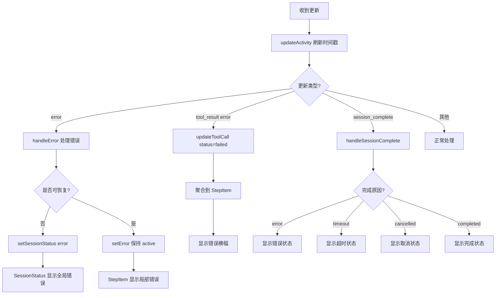

# VCoder V0.2 架构图

## 系统架构概览

```
┌─────────────────────────────────────────────────────────────────┐
│                         VS Code Extension                        │
└─────────────────────────────────────────────────────────────────┘
                                ↓
┌─────────────────────────────────────────────────────────────────┐
│                      Webview UI (React)                          │
│  ┌──────────────┐  ┌──────────────┐  ┌──────────────┐          │
│  │  Chat View   │  │ Step Progress│  │SessionStatus │          │
│  └──────────────┘  └──────────────┘  └──────────────┘          │
│                                                                   │
│  Store (Zustand) - 状态管理 + 异常检测                           │
│  ├─ messages: ChatMessage[]                                      │
│  ├─ sessionStatus: SessionStatus                                 │
│  ├─ lastActivityTime: number                                     │
│  └─ error: ErrorUpdate | null                                    │
└─────────────────────────────────────────────────────────────────┘
                                ↓
                     JSON-RPC 2.0 over postMessage
                                ↓
┌─────────────────────────────────────────────────────────────────┐
│                      ACP Protocol Layer                          │
│  ├─ UpdateNotificationParams (streaming updates)                │
│  ├─ ErrorUpdate (异常信息)                                       │
│  └─ SessionCompleteParams (会话完成通知)                         │
└─────────────────────────────────────────────────────────────────┘
                                ↓
┌─────────────────────────────────────────────────────────────────┐
│                      Agent Server (Node.js)                      │
│  ├─ Claude Code CLI                                              │
│  ├─ Custom Agent                                                 │
│  └─ Multi-Agent Support                                          │
└─────────────────────────────────────────────────────────────────┘
```

## 错误处理与异常检测架构

```
┌─────────────────────────────────────────────────────────────────┐
│                       UI Error Display                           │
│  ┌──────────────────────────────────────────────────────────┐   │
│  │ StepItem Error Banner (步骤级错误)                        │   │
│  │  - 折叠状态：简洁横幅                                     │   │
│  │  - 展开状态：详细错误 + 技术详情                         │   │
│  └──────────────────────────────────────────────────────────┘   │
│  ┌──────────────────────────────────────────────────────────┐   │
│  │ SessionStatus Banner (会话级状态)                         │   │
│  │  - 全局状态展示                                           │   │
│  │  - 错误恢复按钮                                           │   │
│  │  - 技术详情可展开                                         │   │
│  └──────────────────────────────────────────────────────────┘   │
└─────────────────────────────────────────────────────────────────┘
                                ↓
┌─────────────────────────────────────────────────────────────────┐
│                    Store Error Management                        │
│  ┌──────────────────────────────────────────────────────────┐   │
│  │ 状态追踪                                                  │   │
│  │  - sessionStatus: 'idle' | 'active' | 'completed' | ...  │   │
│  │  - lastActivityTime: 活动时间戳                           │   │
│  │  - error: 当前错误信息                                    │   │
│  └──────────────────────────────────────────────────────────┘   │
│  ┌──────────────────────────────────────────────────────────┐   │
│  │ 异常检测                                                  │   │
│  │  - updateActivity(): 刷新活动时间                         │   │
│  │  - handleSessionComplete(): 处理会话完成                  │   │
│  │  - handleUpdate(): 监控所有更新并检测异常                 │   │
│  └──────────────────────────────────────────────────────────┘   │
└─────────────────────────────────────────────────────────────────┘
                                ↓
┌─────────────────────────────────────────────────────────────────┐
│                    Protocol Error Types                          │
│  ┌──────────────────────────────────────────────────────────┐   │
│  │ ErrorCode (错误代码)                                      │   │
│  │  - AGENT_CRASHED: Agent 崩溃                              │   │
│  │  - CONNECTION_LOST: 连接断开                              │   │
│  │  - TOOL_TIMEOUT: 工具超时                                 │   │
│  │  - SESSION_CANCELLED: 会话取消                            │   │
│  │  - RATE_LIMITED: 速率限制                                 │   │
│  │  - CONTEXT_TOO_LARGE: 上下文过大                          │   │
│  │  - 等等...                                                │   │
│  └──────────────────────────────────────────────────────────┘   │
│  ┌──────────────────────────────────────────────────────────┐   │
│  │ ErrorUpdate (错误详情)                                    │   │
│  │  - code: ErrorCode                                        │   │
│  │  - message: 错误消息                                      │   │
│  │  - details?: 技术详情                                     │   │
│  │  - recoverable?: 是否可恢复                               │   │
│  │  - action?: 恢复操作                                      │   │
│  └──────────────────────────────────────────────────────────┘   │
└─────────────────────────────────────────────────────────────────┘
```

## 异常检测流程



## 工具调用聚合与错误显示

```
┌─────────────────────────────────────────────────────────────────┐
│                      Tool Calls Stream                           │
│  Read file1.ts ─┐                                                │
│  Read file2.ts  ├─→ 聚合为一个 Step                              │
│  Read file3.ts ─┘                                                │
│  Bash: npm test ─→ 独立 Step (有输出，不聚合)                    │
└─────────────────────────────────────────────────────────────────┘
                                ↓
┌─────────────────────────────────────────────────────────────────┐
│                    stepAggregator.ts                             │
│  ┌──────────────────────────────────────────────────────────┐   │
│  │ aggregateToSteps()                                        │   │
│  │  - 按类型和操作分组                                       │   │
│  │  - 独立操作保持独立 (Bash, Write, etc.)                  │   │
│  │  - 监控状态：running → completed/failed                   │   │
│  └──────────────────────────────────────────────────────────┘   │
└─────────────────────────────────────────────────────────────────┘
                                ↓
┌─────────────────────────────────────────────────────────────────┐
│                       StepItem.tsx                               │
│  ┌──────────────────────────────────────────────────────────┐   │
│  │ 折叠状态                                                  │   │
│  │  Step 1: Analyzed 3 files ✓                              │   │
│  │  Step 2: Executed npm test ✗                             │   │
│  │  └─ [错误横幅] 操作超时 | 查看详情                       │   │
│  └──────────────────────────────────────────────────────────┘   │
│  ┌──────────────────────────────────────────────────────────┐   │
│  │ 展开状态 (Step 2)                                         │   │
│  │  [错误详情]                                               │   │
│  │   ⚠ 错误发生                                              │   │
│  │   操作超时                                                │   │
│  │   └ 技术详情 ▼                                            │   │
│  │      Bash execution exceeded 5 minute timeout...          │   │
│  │                                                            │   │
│  │  [终端输出]                                               │   │
│  │   $ npm test                                              │   │
│  │   Running tests...                                        │   │
│  │   (output truncated due to timeout)                       │   │
│  └──────────────────────────────────────────────────────────┘   │
└─────────────────────────────────────────────────────────────────┘
```

## 国际化 (i18n) 支持

```
┌─────────────────────────────────────────────────────────────────┐
│                     I18n Provider                                │
│  ┌──────────────────────────────────────────────────────────┐   │
│  │ zh-CN.ts (简体中文)                                       │   │
│  │  Error: {                                                 │   │
│  │    Timeout: '操作超时',                                   │   │
│  │    PermissionDenied: '权限被拒绝',                        │   │
│  │    ConnectionFailed: '连接失败',                          │   │
│  │    AgentCrashed: 'AI 助手意外崩溃',                       │   │
│  │    ...                                                    │   │
│  │  }                                                        │   │
│  └──────────────────────────────────────────────────────────┘   │
│  ┌──────────────────────────────────────────────────────────┐   │
│  │ en-US.ts (English)                                        │   │
│  │  Error: {                                                 │   │
│  │    Timeout: 'Operation timed out',                        │   │
│  │    PermissionDenied: 'Permission denied',                 │   │
│  │    ConnectionFailed: 'Connection failed',                 │   │
│  │    AgentCrashed: 'AI assistant crashed',                  │   │
│  │    ...                                                    │   │
│  │  }                                                        │   │
│  └──────────────────────────────────────────────────────────┘   │
└─────────────────────────────────────────────────────────────────┘
```

## 数据流

### 正常流程
```
User Input → Extension → ACP Server → Agent
                                         ↓
                                    Tool Execution
                                         ↓
Agent Response ← Extension ← ACP Server ←┘
     ↓
Update Store → Update UI → Display in Chat
```

### 错误流程
```
Tool Execution Error
     ↓
ErrorUpdate {code, message, details, recoverable}
     ↓
Extension receives error
     ↓
Send to Webview via UpdateNotificationParams
     ↓
Store.handleUpdate(type: 'error')
     ↓
- Store.setError(errorUpdate)
- Store.setSessionStatus(based on recoverability)
- Store.updateActivity()
     ↓
UI Updates:
- StepItem shows error banner/details
- SessionStatus shows global error (if session-level)
- Error icon in step status
     ↓
User sees friendly error message + recovery options
```

## 关键特性

### 1. 工具调用聚合
- 相同类型的只读操作自动分组
- 减少视觉杂乱
- 提升扫描效率

### 2. 异常检测
- 实时活动监控
- 会话状态追踪
- 工具调用超时检测
- 连接状态监控

### 3. 友好错误提示
- 技术错误转换为易懂语言
- 分级显示（简要 → 详细）
- 多语言支持
- 恢复建议

### 4. 会话状态管理
- 全局状态横幅
- 不同状态的视觉区分
- 可操作的恢复按钮
- 详细技术信息可展开

## 相关文档

- [工具调用聚合](./tool-calls-aggregation.md) - 工具调用分组和显示策略
- [错误处理](./error-handling.md) - 完整的错误处理机制说明
- [ACP 协议](../protocol.md) - Agent Client Protocol 详细规范

## 技术栈

- **前端**: React + TypeScript + Zustand
- **样式**: SCSS + VSCode 主题变量
- **国际化**: 自定义 i18n 系统
- **协议**: JSON-RPC 2.0
- **构建**: Turbo + pnpm workspace
