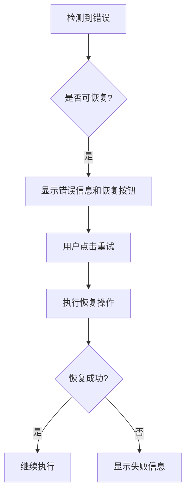
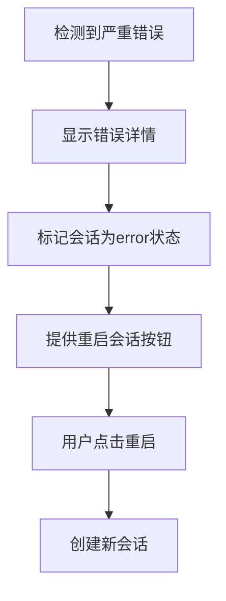

# 错误处理与异常检测

## 概述

VCoder 实现了完善的错误处理和异常检测机制，确保在各种异常情况下都能提供友好的用户体验和清晰的错误提示。

## 设计目标

### 用户体验
- **及时感知**: 用户能够立即察觉到异常情况
- **友好提示**: 使用易于理解的语言描述错误
- **恢复建议**: 提供可操作的恢复方案
- **技术详情**: 为高级用户提供详细的技术信息

### 错误分类
1. **可恢复错误**: 用户可以通过重试或修改操作来恢复
2. **不可恢复错误**: 需要重启会话或联系支持

## 错误类型

### 协议层错误类型 (Protocol)

定义在 `packages/shared/src/protocol.ts`:

```typescript
export type ErrorCode =
    | 'AGENT_CRASHED'        // Agent 进程崩溃
    | 'CONNECTION_LOST'      // 连接断开
    | 'TOOL_TIMEOUT'         // 工具调用超时
    | 'TOOL_FAILED'          // 工具执行失败
    | 'PERMISSION_DENIED'    // 权限被拒绝
    | 'SESSION_CANCELLED'    // 会话被取消
    | 'RATE_LIMITED'         // API 速率限制
    | 'CONTEXT_TOO_LARGE'    // 上下文过大
    | 'INVALID_REQUEST'      // 无效请求
    | 'UNKNOWN_ERROR';       // 未知错误
```

### 错误信息结构

```typescript
export interface ErrorUpdate {
    code: ErrorCode;               // 错误代码
    message: string;                // 错误消息
    details?: string;               // 技术详情
    recoverable?: boolean;          // 是否可恢复
    action?: {                      // 恢复操作
        label: string;
        command: string;
    };
    toolCallId?: string;            // 关联的工具调用ID
}
```

## 会话状态跟踪

### 会话状态类型

```typescript
export type SessionStatus = 
    | 'idle'       // 空闲
    | 'active'     // 进行中
    | 'completed'  // 已完成
    | 'cancelled'  // 已取消
    | 'error'      // 错误
    | 'timeout';   // 超时
```

### 会话完成原因

```typescript
export type SessionCompleteReason =
    | 'completed'           // 正常完成
    | 'cancelled'           // 用户取消
    | 'error'               // 错误终止
    | 'timeout'             // 超时
    | 'max_turns_reached';  // 达到最大对话轮数
```

## 异常检测机制

### 1. 活动时间监控

Store 维护 `lastActivityTime` 字段，记录最后一次活动的时间戳：

```typescript
// 每次收到更新时刷新活动时间
updateActivity: () => set({ 
    lastActivityTime: Date.now(), 
    sessionStatus: 'active' 
})
```

**应用场景**:
- 检测长时间无响应的会话
- 判断会话是否超时
- 优化资源使用（清理闲置会话）

### 2. 工具调用状态监控

每个工具调用都有状态跟踪：
- `pending`: 等待执行
- `running`: 执行中
- `completed`: 成功完成
- `failed`: 执行失败
- `awaiting_confirmation`: 等待用户确认

**超时检测**:
```typescript
// 在 stepAggregator 中监控工具调用时长
const TOOL_TIMEOUT_MS = 300000; // 5分钟

if (toolCall.status === 'running' && 
    Date.now() - toolCall.startTime > TOOL_TIMEOUT_MS) {
    // 标记为超时
    updateToolCall(toolCall.id, {
        status: 'failed',
        error: 'Tool execution timed out'
    });
}
```

### 3. 连接状态监控

Agent 状态监控：
```typescript
export type AgentStatus = 
    | 'online'       // 在线
    | 'offline'      // 离线
    | 'error'        // 错误
    | 'starting'     // 启动中
    | 'reconnecting'; // 重连中
```

## UI 错误提示

### 1. StepItem 级别错误显示

**折叠状态 - 错误横幅**:
```typescript
{isCollapsed && errorInfo && (
    <div className="step-error-banner">
        <ErrorIcon />
        <span>{errorInfo.message}</span>
        <span>查看详情</span>
    </div>
)}
```

**展开状态 - 详细错误信息**:
```typescript
{errorInfo && (
    <div className="step-error-details">
        <div className="step-error-header">
            <ErrorIcon />
            <span>错误发生</span>
        </div>
        <div className="step-error-body">
            <div className="step-error-friendly">
                {errorInfo.message}
            </div>
            <details className="step-error-raw">
                <summary>技术详情</summary>
                <pre>{errorInfo.rawMessage}</pre>
            </details>
        </div>
    </div>
)}
```

**错误类型映射**:
```typescript
// 将技术性错误消息转换为友好提示
const errorPatterns = {
    timeout: '操作超时',
    'permission denied': '权限被拒绝',
    'not found': '文件或资源未找到',
    connection: '连接失败',
    cancelled: '操作已取消',
};
```

### 2. SessionStatus 全局状态横幅

显示会话级别的状态和错误：

```typescript
<SessionStatus 
    status={sessionStatus}
    reason={sessionCompleteReason}
    message={sessionCompleteMessage}
    error={error}
    onRetry={handleRetry}
    onDismiss={handleDismiss}
/>
```

**横幅类型**:
- `error`: 红色，显示错误图标
- `warning`: 黄色，显示警告图标
- `info`: 蓝色，显示信息图标
- `success`: 绿色，显示成功图标

## 错误恢复流程

### 1. 可恢复错误



**示例**: 网络超时
- 错误提示: "连接超时，请重试"
- 恢复操作: 点击"重试"按钮重新发送请求

### 2. 不可恢复错误



**示例**: Agent 崩溃
- 错误提示: "AI 助手意外崩溃"
- 恢复操作: "重启会话"按钮创建新的会话

## 错误处理最佳实践

### 1. 分层处理

```
┌─────────────────────────────────┐
│   UI 层                         │
│   - 显示友好错误提示            │
│   - 提供恢复操作                │
└─────────────────────────────────┘
           ↓
┌─────────────────────────────────┐
│   Store 层                      │
│   - 错误状态管理                │
│   - 会话状态追踪                │
└─────────────────────────────────┘
           ↓
┌─────────────────────────────────┐
│   Protocol 层                   │
│   - 错误类型定义                │
│   - 错误信息结构                │
└─────────────────────────────────┘
```

### 2. 错误信息本地化

所有错误提示都通过 i18n 系统提供多语言支持：

```typescript
// zh-CN
Error: {
    Timeout: '操作超时',
    PermissionDenied: '权限被拒绝',
    // ...
}

// en-US
Error: {
    Timeout: 'Operation timed out',
    PermissionDenied: 'Permission denied',
    // ...
}
```

### 3. 技术详情可展开

默认显示友好提示，技术详情隐藏在可展开的区域中：

```html
<details>
    <summary>技术详情</summary>
    <pre>{technicalError}</pre>
</details>
```

### 4. 错误日志记录

关键错误信息记录在控制台：

```typescript
if (error.code === 'AGENT_CRASHED') {
    console.error('[VCoder] Agent crashed:', {
        error: error.message,
        details: error.details,
        timestamp: Date.now(),
    });
}
```

## 相关文件

### 核心文件
- `packages/shared/src/protocol.ts` - 错误类型定义
- `packages/extension/webview/src/types.ts` - 会话状态类型
- `packages/extension/webview/src/store/useStore.ts` - 错误状态管理

### UI 组件
- `packages/extension/webview/src/components/StepProgress/StepItem.tsx` - 步骤级错误显示
- `packages/extension/webview/src/components/SessionStatus/SessionStatus.tsx` - 会话级状态显示

### 样式文件
- `packages/extension/webview/src/components/StepProgress/index.scss` - 错误显示样式
- `packages/extension/webview/src/components/SessionStatus/SessionStatus.scss` - 状态横幅样式

### 本地化文件
- `packages/extension/webview/src/i18n/locales/zh-CN.ts` - 中文错误提示
- `packages/extension/webview/src/i18n/locales/en-US.ts` - 英文错误提示

## 未来改进

1. **错误统计和分析**
   - 记录错误频率和类型
   - 生成错误报告
   - 优化常见错误的处理

2. **智能错误恢复**
   - 自动重试机制
   - 根据错误类型选择恢复策略
   - 学习用户的恢复偏好

3. **错误预防**
   - 输入验证
   - 资源限制检查
   - 网络状态预检测

4. **用户反馈**
   - 错误报告收集
   - 用户满意度调查
   - 改进建议收集
