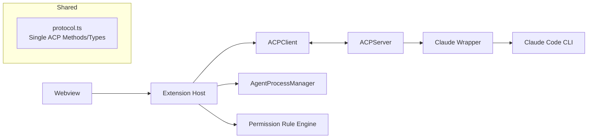

# 技术方案：VCoder V0.3（协议统一、会话稳定、权限收敛）

## 0. 文档信息

- 版本：v0.3
- 日期：2026-02-20
- 对应 PRD：`docs/V0.3/PRD.md`

## 1. 现状评估（代码与质量基线）

## 1.1 构建与测试基线

- `pnpm build` 失败：
  - 协议常量来源冲突导致 `LSP_*` 常量在服务端不可见。
  - `FileChangeUpdate` 类型与运行时对象结构不一致。
- `pnpm test` 失败：
  - 多会话隔离测试超时（`tests/extension/acp-client-multisession.test.ts`）。
  - 扩展激活测试与实际实现不一致（`tests/extension/extension.test.ts`）。

## 1.2 关键现状问题矩阵

| 问题 | 证据 | 影响 | 优先级 |
|---|---|---|---|
| ACP 方法常量双定义且命名风格冲突 | `packages/shared/src/index.ts`、`packages/shared/src/protocol.ts` | 编译失败、协议维护成本高 | P0 |
| 客户端会话请求清理存在竞态 | `packages/extension/src/acp/client.ts` + 失败测试 | 会话切换/删除后请求悬挂或超时 | P0 |
| Agent 选择仍为占位实现 | `packages/extension/src/providers/chatViewProvider.ts` | UI 可切换但运行时未切换 | P0 |
| 构建与测试基线未全绿 | 根工作区 `pnpm build`、`pnpm test` | 无法进入可发布状态 | P0 |
| 权限链路存在双栈 | `packages/server/src/claude/wrapper.ts`、`packages/extension/src/services/permissionProvider.ts` | 规则与交互语义不一致风险 | P1 |
| `clientCapabilities` 宣称能力与实现不完全一致 | `packages/extension/src/extension.ts`、`packages/server/src/acp/server.ts` | 协议协商失真、未来兼容风险 | P1 |
| 持久会话实现未覆盖 `control_request` | `packages/server/src/claude/persistentSession.ts` | 切到持久模式后权限交互不完整 | P1 |
| 权限规则面板生命周期实现有误 | `packages/extension/webview/src/components/PermissionRulesPanel.tsx` | 列表刷新与监听可靠性问题 | P1 |
| DiffManager 未形成主链路闭环 | `packages/extension/src/services/diffManager.ts` | 维护成本高、行为分叉 | P2 |

## 2. V0.3 设计目标

1. 协议单源：方法名、类型、常量只维护一份。
2. 会话确定性：请求生命周期与 session 生命周期严格对齐。
3. 权限单语义：用户只理解一种审批模型，支持规则化。
4. Agent 可运行切换：从 UI 到进程到传输完整闭环。
5. 交付可发布：构建、测试、打包链路全绿。

## 3. 总体架构调整

关键调整：

- `protocol.ts` 成为协议单一真源，`index.ts` 只做 re-export。
- ACPClient 引入“请求索引 + 会话索引”双索引，清理逻辑统一。
- AgentProcessManager 接管 Agent 切换与状态事件。
- 权限规则引擎在 Extension 层统一复用（CLI/ACP agent 共用）。

## 4. 模块级方案

## 4.1 Shared 协议包（P0）

### 目标

- 消除 `ACPMethods` 双定义与方法名漂移。

### 变更

1. 在 `packages/shared/src/index.ts` 删除重复 `ACPMethods` 定义，仅 `export * from './protocol'`。
2. 明确 V0.3 canonical method 名称（统一使用 `protocol.ts` 当前定义）。
3. 引入兼容映射（例如旧斜杠方法名），仅用于解析层，不再向外导出双写常量。

### 兼容策略

- 服务端请求分发层支持旧方法名 alias（一个小版本周期）。
- 新增日志：记录 alias 命中次数，为后续移除提供依据。

## 4.2 ACPClient 会话隔离重构（P0）

### 目标

- 修复切换/删除会话时 pending request 未及时结束的问题。

### 变更

1. 将 `pendingRequests` 结构改为：
   - `Map<requestId, PendingRequest>`
   - `Map<sessionId, Set<requestId>>`
2. 在 `switchSession` / `deleteSession` 中调用统一 `cancelPendingBySession(sessionId, reason)`。
3. 统一错误码与错误消息，避免 unhandled rejection。
4. 为 `shutdown()` 增加幂等防护，避免重复 reject。

### 验证

- `tests/extension/acp-client-multisession.test.ts` 全通过。

## 4.3 ACPServer 路由与能力协商（P0/P1）

### 目标

- 让服务端行为与客户端宣称能力一致。

### 变更

1. 服务端保存 `initialize.clientCapabilities`，作为运行时协商依据。
2. 对未实现能力不再宣称支持，或明确标记为实验能力。
3. 修复 `handleSwitchSession` 通知类型与协议定义不一致问题（补类型或改事件）。

### 可选增强（P1）

- 若 V0.3 需要开启 `fs/*`、`terminal/*` 回调：在 ACPServer 增加 `sendRequestToClient` 转发处理，并在 Extension 注册对应 handler。

## 4.4 权限链路收敛（P1）

### 目标

- 用户只看到一套一致审批行为。

### 变更

1. 将权限规则匹配抽为独立 `PermissionRuleEngine`（Extension 复用）。
2. 明确两类来源：
   - CLI `control_request(can_use_tool)` -> `confirmation_request` -> `tool.confirm`
   - 外部 ACP agent `session.requestPermission` -> `PermissionDialog`
3. UI 层合并文案与动作语义（Allow once / Always allow / Deny）。
4. 规则持久化统一落 `SessionStore.globalState`，并记录审计事件。

## 4.5 Agent 运行时接入（P0）

### 目标

- `selectAgent` 从“提示已选择”变成真实运行时切换。

### 变更

1. `extension.ts` 注入 `AgentProcessManager` 生命周期管理。
2. `chatViewProvider.selectAgent` 执行：
   - 停止当前 agent 进程
   - 启动目标 agent 进程
   - `acpClient.updateTransport()` 切换 stdio
   - 推送真实状态到 Webview
3. 默认策略：切换 agent 自动新建会话，避免上下文污染。

## 4.6 Webview 修复（P1）

### 目标

- 消除 UI 生命周期与状态同步隐患。

### 变更

1. `PermissionRulesPanel` 将 `useState(() => { ... })` 副作用改为 `useEffect`。
2. 历史模式退出时恢复最近 live session（不再硬置 `currentSessionId=null`）。
3. 补充规则列表加载失败/重试 UI。

## 4.7 类型与编译修复（P0）

### 目标

- 解决当前构建失败项，建立“编译即红线”。

### 变更

1. 修复 `packages/server/src/claude/wrapper.ts` 中 `FileChangeUpdate` 非法字段写入。
2. 统一 shared 类型导入源，避免 index/protocol 分裂。
3. 扩展单测 mock 补齐 `getLspService` 等新接口。

## 5. 测试与质量门禁

## 5.1 单元/集成测试

- 必测：
  - ACPClient 多会话清理（switch/delete/shutdown）。
  - 协议 alias 兼容解析。
  - 权限规则匹配（toolName + pattern + expiresAt）。
  - Agent 切换后 transport 重连。

## 5.2 工程门禁

- CI 必须通过：
  - `pnpm build`
  - `pnpm test`
  - VSIX 打包 smoke（安装后首轮会话）

## 5.3 回归清单

- 会话切换时流式输出不串台。
- 审批拒绝后无卡死，无悬挂 confirmation。
- 切换 Agent 后状态与执行器一致。

## 6. 迭代拆分（建议）

### Iteration 1（P0）

- Shared 协议统一
- 编译错误清零
- ACPClient 多会话清理修复

### Iteration 2（P0/P1）

- AgentProcessManager 接入与真实切换
- 扩展测试修复并补齐

### Iteration 3（P1）

- 权限规则引擎收敛
- PermissionRulesPanel 生命周期修复

### Iteration 4（P1/P2）

- 能力协商细化（必要时补 fs/terminal 回调）
- VSIX 与发布流程收尾

## 7. 风险与缓解

- 风险：协议变更牵动面广。
  - 缓解：兼容映射 + 渐进迁移 + 契约测试。
- 风险：Agent 切换引入进程泄漏。
  - 缓解：统一 stop/start 状态机 + 健康检查。
- 风险：权限双路径并存期间行为不一致。
  - 缓解：统一规则引擎与统一 UI 动作语义。

## 8. V0.3 完成定义（DoD）

1. 主分支构建与测试持续稳定通过。
2. 多会话与权限回归清单全部通过。
3. Agent 选择器为真实运行时切换。
4. 协议定义单源且无重复常量。
5. 文档（PRD + TECH）与实现状态一致。

## 9. 执行与治理同步（由 docs 根目录收敛）

## 9.1 执行门禁（工程红线）

CI 与本地门禁统一为：

- `pnpm lint`
- `pnpm build`
- `pnpm test`
- `pnpm --filter @vcoder/extension package`

仅当上述门禁通过，方可判定进入 V0.3 RC 提交流程。

## 9.2 问题优先级映射

| 编号 | 问题 | 在本方案中的落点 |
|---|---|---|
| P0-01 | ACP 双定义与命名混用 | 4.1 Shared 协议包 |
| P0-02 | 会话 pending 清理不完整 | 4.2 ACPClient 会话隔离重构 |
| P0-03 | Agent 切换仍为占位 | 4.5 Agent 运行时接入 |
| P0-04 | 构建/测试未全绿 | 4.7 类型与编译修复 + 5.2 工程门禁 |
| P1-01 | 权限链路双栈 | 4.4 权限链路收敛 |
| P1-02 | 能力协商失真 | 4.3 ACPServer 路由与能力协商 |
| P1-03 | persistent `control_request` 缺口 | 4.4 权限链路收敛（含 persistent 场景） |
| P1-04 | 权限规则面板生命周期问题 | 4.6 Webview 修复 |
| P2-01 | DiffManager 闭环不足 | 4.6 Webview 修复（UI 协同）+ 后续迭代 |

## 9.3 UI 设计规范基线（V0.3）

Webview 改造必须遵循：

1. 颜色、文本、边框统一使用 `--vscode-*` 与 `--vc-*` 变量。
2. 间距使用 `--vc-padding` 倍数体系；圆角使用 `--vc-radius-*`。
3. 动效使用统一时长与缓动曲线（`--vc-motion-*`）。
4. 禁止新增硬编码主题色与跨会话副作用写法。
5. 通用组件优先复用（Button/Dropdown/Card/Modal），避免局部重复实现。

## 9.4 UI 实施步骤（按优先级）

Step 1（P0）：状态一致性

- 会话态按 `sessionId` 隔离。
- 切换会话同步切换消息/工具/文件变更视图。
- 历史模式退出后恢复 live session。

Step 2（P1）：权限交互一致性

- 审批语义固定为 `Allow once / Always allow / Deny`。
- 规则列表支持加载失败与重试。
- 拒绝路径可恢复，不阻塞后续操作。

Step 3（P1）：组件复用与样式清理

- 新改动优先复用通用组件。
- 清理硬编码颜色与非标准间距/圆角。
- 增补 UI 回归记录，覆盖会话与权限关键路径。

## 10. 文档单一入口

V0.3 仅保留以下文档作为有效入口：

- `docs/V0.3/PRD.md`
- `docs/V0.3/TECH-SOLUTION.md`

原 `docs` 根目录的执行/问题/UI 收敛文档已合并入本技术方案与 PRD。
