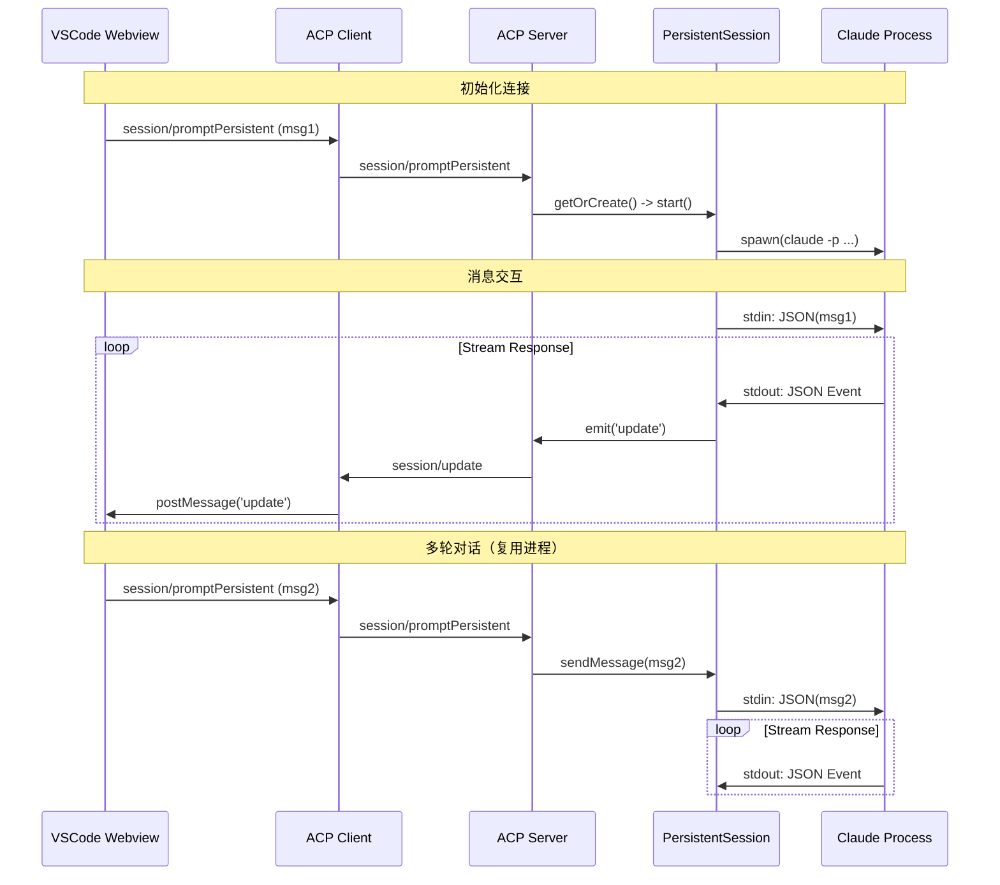

> [Archived] 本文为 V0.5 前的架构分析记录。文中涉及的 Chain A（session/requestPermission、BashConfirm 等）已在 V0.6 中移除，权限链路已统一为 Chain B（control_request + tool/confirm）。

# 双向流式通信 (Bidirectional Streaming) - 分析与方案总结

## 1. 背景
VCoder 原有的与 Claude Code CLI 交互方式为单次请求-响应模式（Spawn -> Output -> Close），存在以下局限：
- **高延迟**：每次交互都需要启动新的 CLI 进程。
- **状态丢失**：无法在同一进程内维持上下文，依赖 `--resume`。
- **交互受限**：不支持中途的 Bash 确认、Plan 确认或连续追问，只能通过新的单次命令处理。

目标是实现 **持久化双向流式通信**，复用 CLI 进程，支持实时交互。

## 2. Claude Code CLI 能力分析

经过调研和验证，Claude Code CLI 具备以下支持流式交互的能力：

### 2.1 启动参数
使用以下参数启动 CLI 可进入双向流式模式：
```bash
claude -p \
  --output-format stream-json \
  --input-format stream-json \
  --verbose \
  --include-partial-messages \
  --replay-user-messages
```

*   `--input-format stream-json`: 允许通过 Standard Input (stdin) 发送 NDJSON 格式的消息。
*   `--output-format stream-json`: 通过 Standard Output (stdout) 输出 NDJSON 格式的事件流。
*   `-p`: 启用非交互模式（Headless），必须配合使用。

### 2.2 消息格式协议

**输入 (Stdin)**:
经过验证，CLI 接受的正确用户消息格式为：
```json
{
  "type": "user", 
  "message": {
    "role": "user", 
    "content": "用户消息内容"
  }
}
```

**输出 (Stdout)**:
CLI 会输出一系列 JSON 事件，关键类型包括：
- `system`: 会话初始化信息。
- `assistant`: AI 的回复，包含 `thinking` (思考块)、`text` (文本块)、`tool_use` (工具调用)。
- `content_block_delta`: 流式增量更新（如打字机效果）。
- `result`: 命令执行结果或错误。

## 3. 技术方案架构

### 3.1 后端改造 (Server)

引入 **持久会话 (Persistent Session)** 机制：

1.  **`PersistentSession` 类** (`packages/server/src/claude/persistentSession.ts`):
    *   **进程管理**：负责 spawn CLI 进程，并保持 stdin 开放。
    *   **消息发送**：封装 `sendMessage` 方法，将用户消息转换为 NDJSON写入 stdin。
    *   **流式解析**：监听 stdout，解析 NDJSON 流，转换为 VCoder 内部的 `UpdateNotificationParams` 事件并分发。
    *   **生命周期**：处理进程的启动 (`start`)、停止 (`stop`) 和异常退出。

2.  **`ClaudeCodeWrapper` 改造** (`packages/server/src/claude/wrapper.ts`):
    *   维护 `persistentSessions` Map，管理多会话实例。
    *   新增 `promptPersistent` 方法：如果会话存在则复用，否则新建。
    *   新增 `stopPersistentSession` 方法。

3.  **ACP 协议扩展** (`packages/shared/src/protocol.ts`):
    *   新增 Client -> Server 方法：
        *   `session/promptPersistent`: 发送消息（持久模式）。
        *   `session/stopPersistent`: 结束会话。
        *   `session/modeStatus`: 查询会话状态。
    *   保留原有 `session/prompt` (单次模式) 以兼容旧逻辑。

### 3.2 交互流程



## 4. 当前实施状态

### ✅ 已完成 (Backend)
1.  **CLI 验证**：确认了 `--input-format stream-json` 的可行性及消息格式。
2.  **核心代码实现**：
    *   完成了 `PersistentSession` 类的编写，实现了双向流的处理逻辑。
    *   更新了 `ClaudeCodeWrapper` 集成持久会话。
    *   扩展了 `ACPServer` 处理新的 RPC 请求。
3.  **协议定义**：在 `packages/shared` 中添加了相关类型定义。
4.  **构建验证**：后端代码已通过编译。

### 🚧 待解决/进行中 (Frontend & Integration)
1.  **UI 集成**：需要更新 Webview 的 `ChatViewProvider` 以调用新的持久化 API。
2.  **流式显示问题**：目前发现 UI 在接收流式消息时存在延迟（只在完成后显示），可能是前端消息转发或状态更新逻辑的问题，需进一步排查 `ChatViewProvider` 中的事件监听和转发代码。
3.  **交互确认**：Bash/Plan 的确认机制在持久模式下需要适配（目前 CLI 流式输入支持 `control` 类型消息或工具结果反馈，需进一步对接）。

## 5. 后续计划
1.  修复 Frontend 流式显示不同步的问题。
2.  在 UI 层实现 `ToolConfirmDialog` 和 `ConnectionStatus` 组件。
3.  进行端到端的集成测试。
