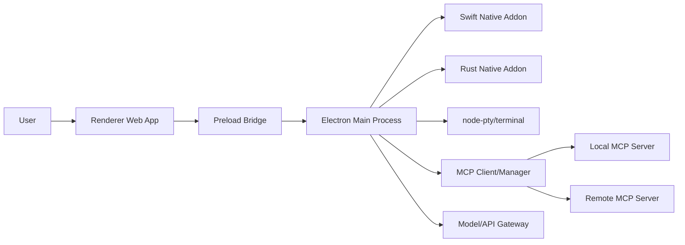

# 技术分析：Claude 桌面版复刻方案（基于静态解包取证）

## 0. 文档信息

- 文档版本：v1.0
- 创建日期：2026-02-18
- 分析对象：Claude Desktop `1.1.3363`（本机样本）
- 相关 PRD：`docs/plan/claude-desktop-replica-prd.md`

## 1. 分析目标与边界

### 1.1 目标

- 明确 Claude Desktop 的技术栈与运行架构。
- 形成可执行的“同类产品复刻”工程方案。
- 给出安全、可维护、可发布的落地路径。

### 1.2 边界

- 仅做静态取证与行为级架构推断。
- 不复制闭源代码、私有协议、品牌资产与服务端逻辑。
- 复刻策略采用 clean-room：能力等价，不做实现等价。

## 2. 关键取证证据（本机）

| 证据路径 | 观测 | 推断 |
|---|---|---|
| `/Applications/Claude.app/Contents/Info.plist` | `NSPrincipalClass=AtomApplication`、`electron.icns`、`ElectronAsarIntegrity` | 应用壳是 Electron |
| `/Applications/Claude.app/Contents/Frameworks/Electron Framework.framework/Electron Framework` | 命中 `Electron v40.4.1`、`Chrome/144.0.7559.173` | Electron 40 + Chromium 144 |
| `/Applications/Claude.app/Contents/Resources/app.asar` | 存在 `.vite/build`、`.vite/renderer` 结构 | Vite 构建的 Web 前端 |
| `.analysis/claude-app-asar/package.json` | `react`、`vite`、`tailwindcss`、`@modelcontextprotocol/sdk`、`node-pty`、`@sentry/electron` | React + Vite + Tailwind + MCP + 终端 + 观测 |
| `.analysis/claude-app-asar/.vite/build/mainView.js` | `contextBridge.exposeInMainWorld`、`ipcRenderer.invoke`、origin 校验 | preload IPC 桥 + 域名白名单 |
| `.analysis/claude-app-asar/.vite/build/index.js` | `setWindowOpenHandler`、`webRequest.onBeforeRequest`、权限处理器 | 主进程负责导航/权限安全策略 |
| `/Applications/Claude.app/Contents/Resources/app.asar.unpacked/node_modules/@ant/claude-swift/build/Release/swift_addon.node` | 链接 `Virtualization`、`ScreenCaptureKit`、`Speech` | Swift 原生层负责系统级能力 |
| `/Applications/Claude.app/Contents/Resources/app.asar.unpacked/node_modules/@ant/claude-native/claude-native-binding.node` | 字符串显示 Rust/NAPI 风格符号 | 另有 Rust 原生桥接层 |
| `/Applications/Claude.app/Contents/Resources/claude-ssh/version.txt` | `2026-02-17T16:09:56Z` | 附带独立 SSH 二进制能力链路 |

## 3. 技术栈结论

### 3.1 壳层与前端

- Electron 40.x（多进程：主进程、渲染进程、Helper 进程）
- 前端 React 18 + Vite + Tailwind
- 打包/发行使用 Electron Forge（dmg/msix/squirrel）

### 3.2 本地能力层

- Node 原生模块（`node-pty`）用于终端 PTY 能力
- Swift N-API 模块承担 macOS 深系统能力（快捷入口、截图、语音、虚拟化）
- Rust N-API 模块承担部分跨平台系统能力桥接

### 3.3 协议与生态

- MCP 相关 SDK 存在，说明工具生态采用 MCP 或兼容机制
- 具备桌面扩展安装/管理能力痕迹（扩展目录、安装流程、状态监听）

### 3.4 可观测性

- Sentry + Winston 组合用于错误监控与日志

## 4. 架构推断（逻辑分层）



## 5. 可复刻实现方案（建议）

### 5.1 工程分层

- `apps/desktop-shell`
- Electron 主进程、窗口管理、系统托盘、更新器、权限中心
- `apps/desktop-web`
- React 前端（聊天、工具时间线、设置、MCP 管理）
- `packages/desktop-bridge`
- preload API 协议定义（TypeScript 类型 + runtime 校验）
- `packages/native-macos`（可选）
- Swift 模块，首期只做快捷键/截图，语音后置
- `packages/agent-runtime`
- 模型请求编排、工具调度、MCP 客户端、审计事件

### 5.2 关键设计决策

- 决策 A：主进程只暴露最小 API；渲染进程不直接访问 Node。
- 决策 B：工具执行统一走“权限检查器”，禁止绕过。
- 决策 C：终端执行采用独立执行器（PTY + 输出分片 + kill/wait）。
- 决策 D：MCP 管理器与会话状态解耦，支持热更新 server 配置。

### 5.3 API 设计草案（preload）

```ts
interface DesktopBridge {
  app: {
    getVersion(): Promise<string>;
    openExternal(url: string): Promise<void>;
  };
  settings: {
    get(): Promise<AppSettings>;
    set(partial: Partial<AppSettings>): Promise<void>;
  };
  permissions: {
    request(input: PermissionRequest): Promise<PermissionDecision>;
  };
  terminal: {
    create(input: TerminalCreate): Promise<{ id: string }>;
    output(id: string): Promise<TerminalChunk[]>;
    kill(id: string): Promise<void>;
  };
  mcp: {
    listServers(): Promise<McpServerState[]>;
    upsertServer(config: McpServerConfig): Promise<void>;
    call(input: McpCall): Promise<McpResult>;
  };
}
```

## 6. 安全模型复刻

### 6.1 进程与隔离

- `contextIsolation: true`
- `nodeIntegration: false`
- preload 白名单导出
- `setWindowOpenHandler` 默认拒绝

### 6.2 网络与导航

- 主框架导航仅允许受信任域名
- 非白名单 URL 一律系统浏览器打开或直接阻断
- 可配置企业策略白名单（本地签名配置）

### 6.3 权限治理

- 操作分级：`read` / `write` / `execute` / `capture`
- 决策级别：`once` / `session` / `always` / `deny`
- 审计记录：请求参数摘要、决策人、时间戳、结果码

## 7. Native 能力复刻优先级

### 7.1 V1 必做

- 全局快捷键（Electron 原生能力即可）
- 截图（优先 Electron `desktopCapturer`，必要时补 Swift）
- 终端 PTY（`node-pty`）

### 7.2 V1.1+ 可选

- 语音听写（macOS Speech）
- 更深系统集成（菜单栏增强、窗口追踪）
- 虚拟化能力（仅在明确业务价值后开启）

## 8. 构建与发布方案

### 8.1 构建

- Web：Vite 打包
- Shell：Electron Forge
- Native：`prebuild` 或 CI 产物注入（按平台/架构）

### 8.2 发布

- macOS：签名 + notarization + dmg
- Windows：MSIX 或 Squirrel（二选一优先）
- 自动更新：分渠道（stable/beta/dev）

## 9. 测试策略

- 单测：权限引擎、MCP 管理器、终端执行器
- 集成：preload IPC 合约测试
- E2E：主窗口聊天、权限弹窗、MCP 调用、更新流程 smoke test
- 安全：导航绕过、IPC 参数注入、命令注入测试

## 10. 实施路线（12-14 周）

1. 周 1-3：Shell 基础、Web 基础、preload 合约。
2. 周 4-6：会话流式、工具时间线、MCP 管理器。
3. 周 7-9：权限中心、终端执行器、审计系统。
4. 周 10-12：性能与稳定性、签名发布、公测闭环。
5. 周 13-14：根据反馈补齐 V1 阻断问题。

## 11. 主要风险与缓解

- 风险：native 模块维护成本高。
- 缓解：V1 优先 Electron 原生 API，native 只做刚需能力。
- 风险：权限弹窗打断体验。
- 缓解：分级授权 + 会话级记忆 + 明确风险文案。
- 风险：MCP server 质量参差。
- 缓解：健康检查、超时/重试、隔离执行、失败可回退。

## 12. 结论

从静态证据看，Claude Desktop 的核心可抽象为：

- Electron 桌面壳 + React Web 交互层
- preload IPC 安全桥
- MCP 驱动的工具生态
- 原生模块承接系统级能力

这条路线完全可在 clean-room 前提下复刻。建议先做“70% 价值的稳定版本”：

- 主窗口 + Quick Entry
- MCP + 工具时间线
- 权限中心 + PTY

再逐步补语音、虚拟化与企业级能力。

